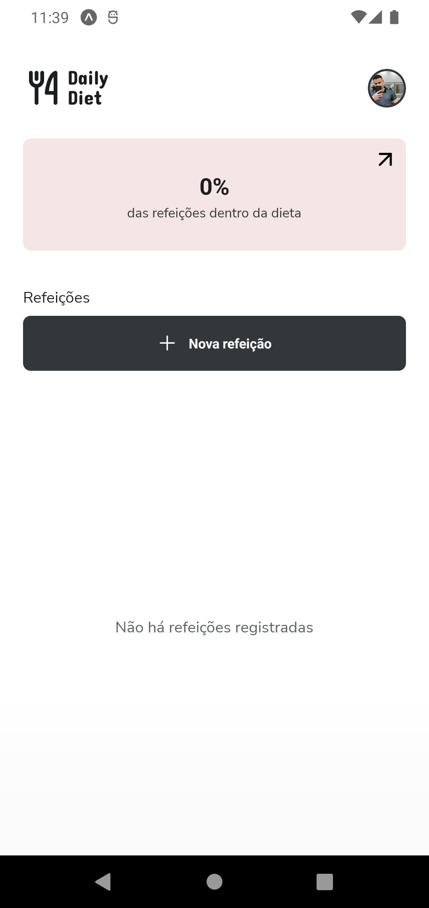
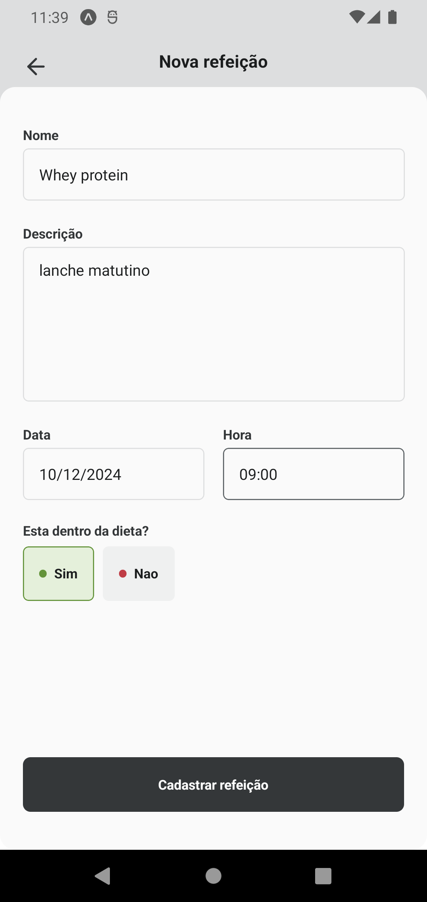
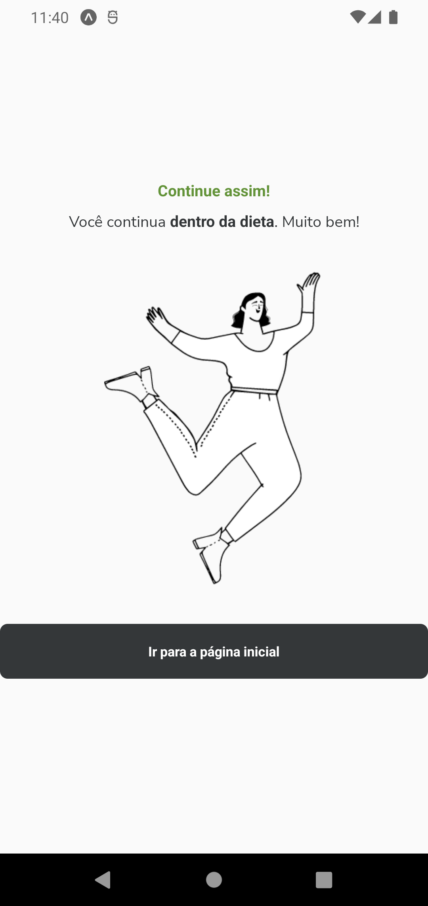
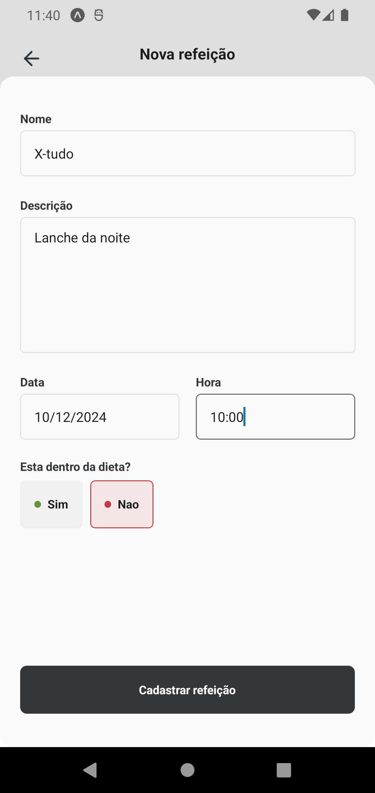
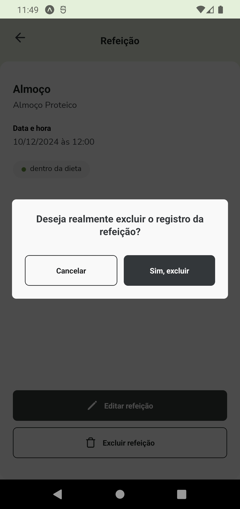
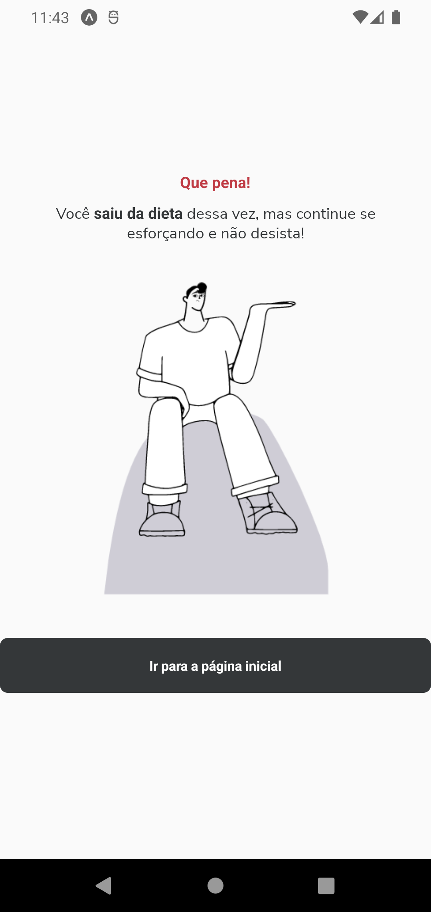
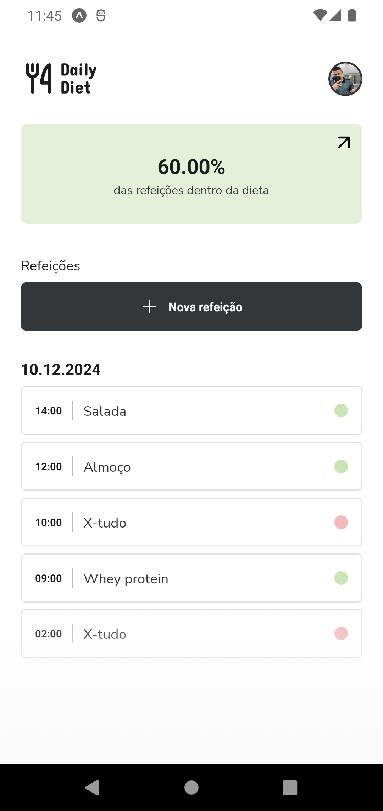
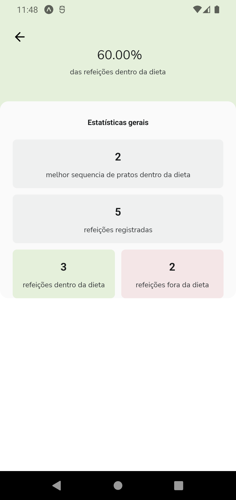
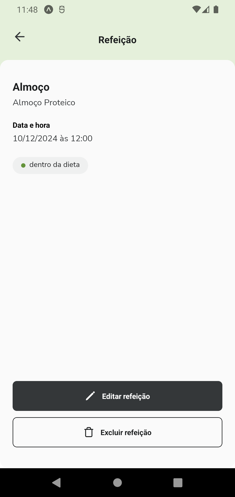
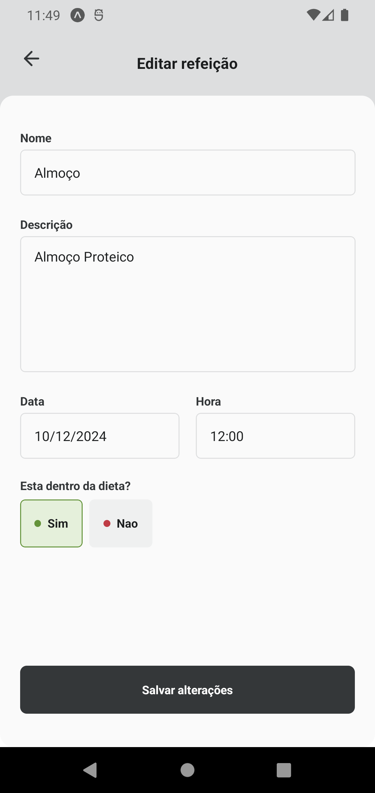

# 📱 Daily Diet  

O **Daily Diet** é uma aplicação desenvolvida com **Expo Router** e **React Native**, utilizando **TypeScript**, **Tailwind CSS** e **Zustand** para gerenciamento de estado.  

A proposta principal do projeto é auxiliar os usuários a:  
- Registrar suas refeições diárias.  
- Monitorar o progresso e histórico de dieta.  
- Obter estatísticas detalhadas dos dias de dieta.  
- Editar, cadastrar e apagar refeições.  
- Persistir os dados localmente com **Async Storage**.  

---

## ✨ Tecnologias Utilizadas  

- **React Native**  
- **Expo Router**  
- **TypeScript**  
- **Tailwind CSS** (para estilização)  
- **Zustand** (para gerenciamento de estado)  
- **Async Storage** (para persistência de dados local)  
- **Biome.js** (para análise estática de código e formatação)  

---

## 📸 Imagens de Exemplo  


  

  

  

  

  

  

  

  

  

  

---

## ⚙️ Pré-requisitos  

- **Node.js** instalado.  
- Para rodar no smartphone:  
  - Instale o aplicativo **Expo Go**.  
- Para rodar no computador:  
  - Use um emulador Android (recomendado).  

---

## 🚀 Instalação e Execução  

1. Clone este repositório:  
   ```bash
   git clone https://github.com/seu-usuario/seu-repositorio.git
   cd seu-repositorio

2. Instale as dependências:

npm install

3. Inicie o servidor do Expo:

npx expo start -c